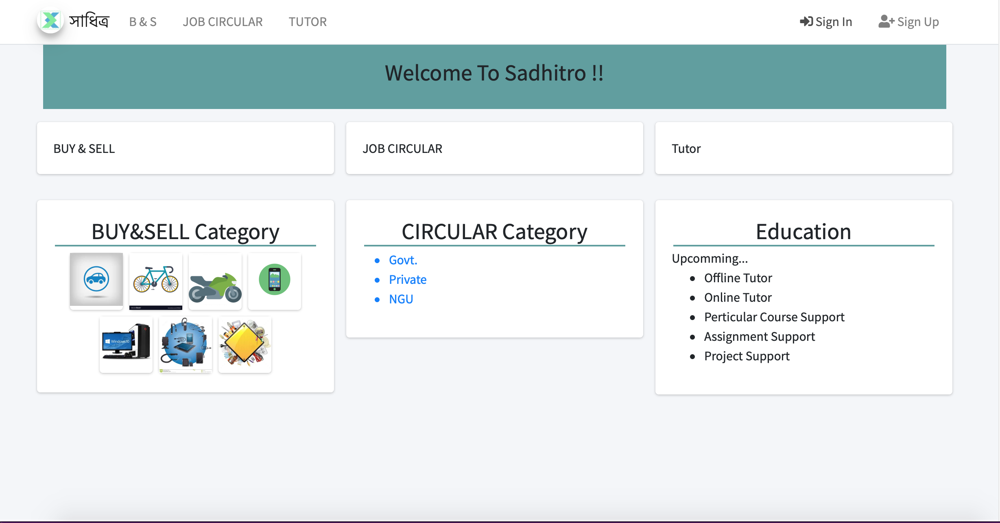
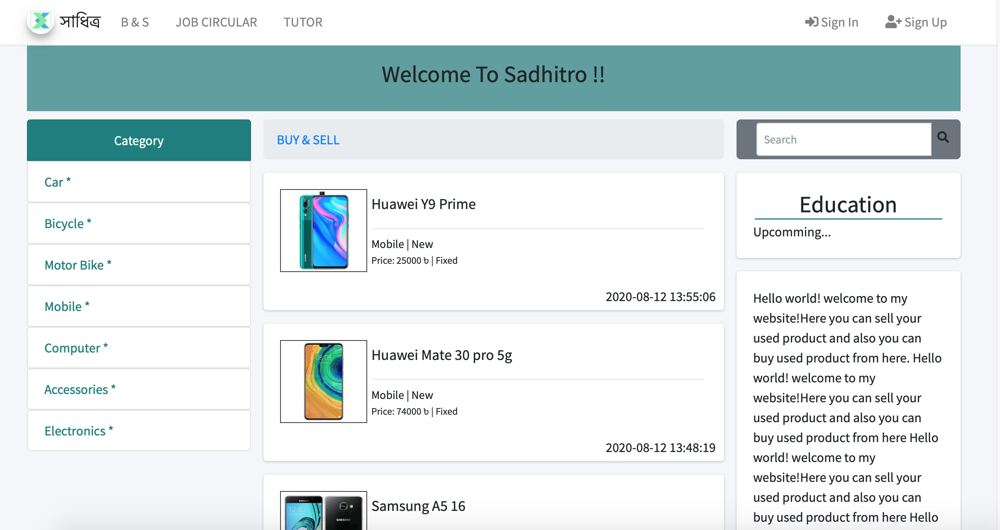
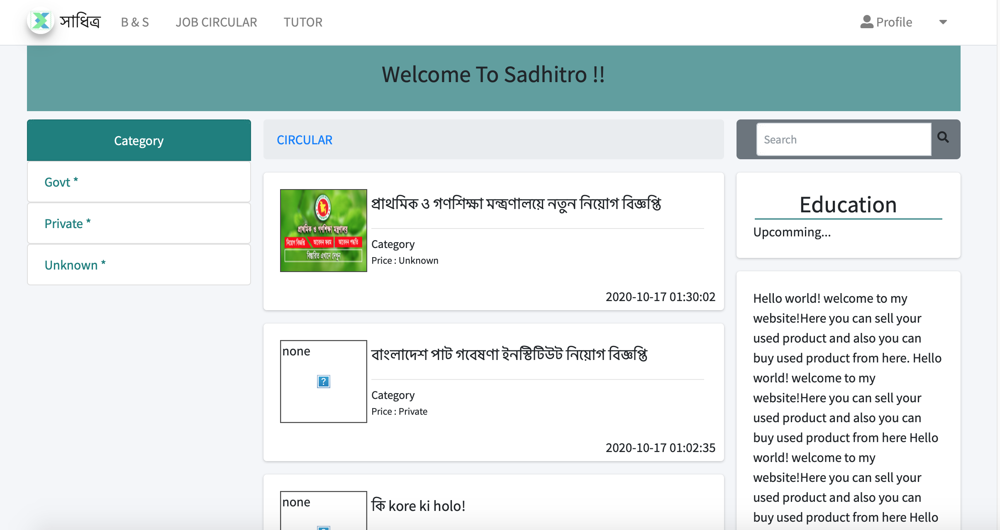
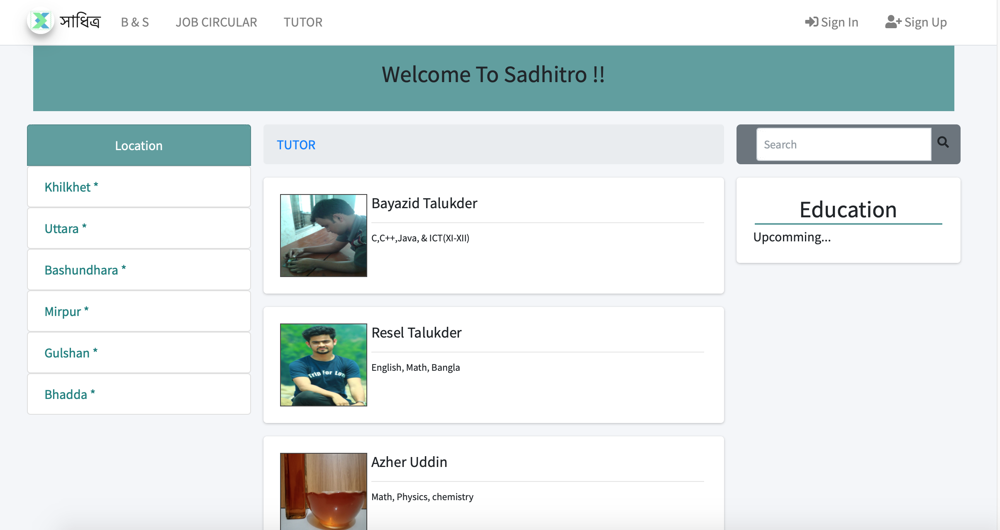
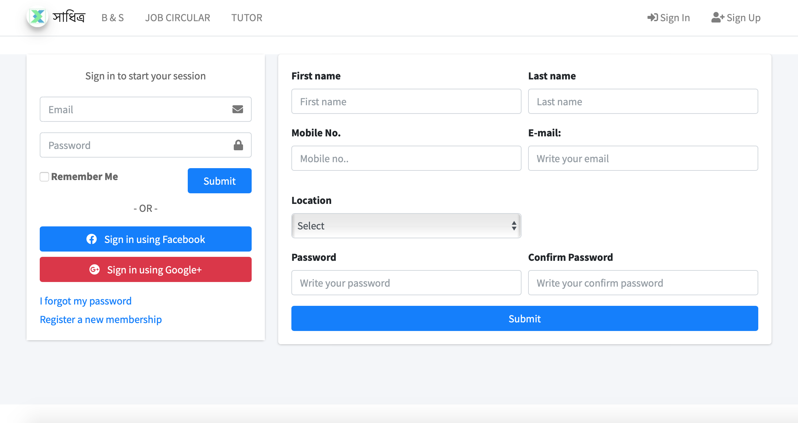

# sadhitro

  
Table of Contents

  <ol>
    <li>
      <a href="#about-the-project">About The Project</a>
      <ul>
        <li><a href="#Landing">Landing Page</a></li>
        <li><a href="#Buy-Sell">Buy-Sell Page</a></li>
        <li><a href="#Circular">Circular Page</a></li>
        <li><a href="#Tutor">Tutor Page</a></li>
        <li><a href="#Login">Login Page</a></li>
      </ul>
    </li>
    <li>
      <a href="#getting-started">Getting Started</a>
     
  </ol>

<!-- ABOUT THE PROJECT -->

## about the project

This project is just for design a simple admin panel using pure HTML,CSS, and JS.

### Landing

   

    
   

### Buy-Sell

   

    
   

### Circular

   

    
   

### Tutor

   

    
   

### Login

   

    
   

